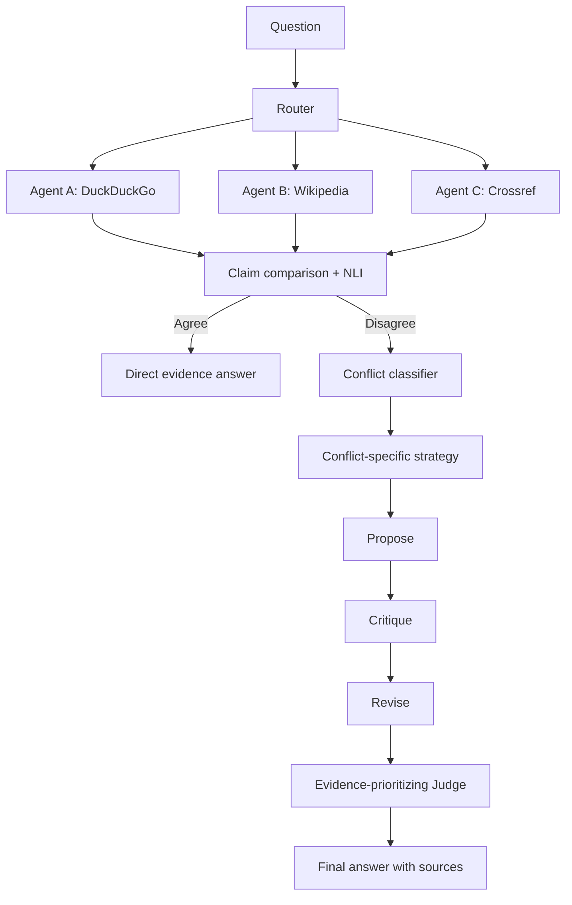

# Evidence-MAD

Evidence-MAD is a research prototype for **evidence-triggered, conflict-type-aware multi-agent debate**.
It retrieves evidence independently, compares claims, and debates only when the evidence disagrees.

The central experiment is:

```text
Question
  -> independent retrieval
  -> claim/evidence comparison
  -> AGREE: answer directly and skip debate
  -> DISAGREE: classify conflict -> Propose/Critique/Revise -> Judge -> answer
```

## 1. Requirements

- Python 3.10 or newer
- Internet access for real search mode
- An OpenAI-compatible LLM API key for real LLM reasoning
- Optional: Hugging Face model download for transformer NLI

The offline demo mode does not require API keys.

## 2. Installation

From the repository root:

```bash
cd mad
python -m venv .venv
source .venv/bin/activate        # Windows PowerShell: .venv\\Scripts\\Activate.ps1
python -m pip install --upgrade pip
python -m pip install -r requirements.txt
cp .env.example .env             # Windows: copy .env.example .env
```

`.env` is local-only and is ignored by Git. Never commit API keys.

## 3. Configuration

Edit `.env` as needed:

```dotenv
LLM_API_KEY=your_llm_key
LLM_BASE_URL=https://api.openai.com/v1
LLM_MODEL=gpt-4o-mini
LLM_TEMPERATURE=0.3

# Optional Google provider; the default agents do not need these.
SEARCH_API_KEY=
SEARCH_ENGINE_ID=
SEARCH_BASE_URL=https://www.googleapis.com/customsearch/v1

# Fast local mode uses deterministic NLI. Real research mode uses Transformers.
NLI_MODE=mock
NLI_MODEL=ynie/roberta-large-snli_mnli_fever_anli_R1_R2_R3-nli
NLI_DEVICE=cpu

DISAGREEMENT_THRESHOLD=0.70
MAX_DEBATE_ROUNDS=3
MAX_SEARCH_RESULTS=5
DEMO_MODE=false
LOG_LEVEL=INFO
```

Use `NLI_MODE=mock` for a quick run or when the Hugging Face model is unavailable.
Use `NLI_MODE=transformers` for the configured NLI model. The first transformer run may download a large model.

## 4. Run the command-line application

### Offline demo mode

This is the easiest way to verify both branches without credentials:

```bash
python app.py --demo
```

Try these questions at the prompt:

```text
What is Python?
When was the policy introduced?
What version supports feature X?
```

The first normally demonstrates `AGREE -> debate skipped`; the policy/version examples demonstrate a disagreement and adaptive debate. Type `quit` to exit.

### Real retrieval mode

Set `DEMO_MODE=false`, configure a valid LLM endpoint/key, then run:

```bash
python app.py
```

The default independent search agents are:

| Agent | Free provider | Focus |
|---|---|---|
| `search_agent_a` | DuckDuckGo HTML | General web sources |
| `search_agent_b` | Wikipedia public API, then DuckDuckGo fallback | Reference/background sources |
| `search_agent_c` | Crossref scholarly API, then DuckDuckGo academic fallback | Academic/historical sources |

No search API key is required for these default providers. Results may overlap because different indexes can contain the same fact, but each agent uses a different provider/query focus and preserves its provider metadata.

## 5. Run the web interface locally

Start the backend in one terminal:

```bash
source .venv/bin/activate
uvicorn api:app --reload --host 127.0.0.1 --port 8000
```

Start the no-build frontend in a second terminal:

```bash
python -m http.server 3000 --bind 127.0.0.1 --directory frontend
```

Open:

- Frontend: http://127.0.0.1:3000
- Swagger API docs: http://127.0.0.1:8000/docs
- Health check: http://127.0.0.1:8000/health

In the frontend, enable **Demo mode (offline)** for deterministic testing. Disable it for real search and LLM calls.

Test the API directly:

```bash
curl -X POST http://127.0.0.1:8000/api/solve \\
  -H "Content-Type: application/json" \\
  -d '{"query":"What is Python?","demo_mode":true}'
```

The response includes `answer`, `evidence`, `sources`, `debate_triggered`, `conflict_type`, `judge`, and `metrics`.

## 6. Inspect traces and metrics

Every solve saves a JSON execution trace under `results/`:

```text
results/trace_<id>.json
```

A trace records the query, routing, independent evidence, claims, comparison scores, gate decision, conflict type, debate rounds, judge output, latency, and LLM call count.

Important fields include:

```text
 evidence_agreement
 contradiction_score
 debate_triggered
 conflict_type
 debate_rounds
 total_llm_calls
 latency_seconds
```

## 7. Run tests

```bash
pytest -q
```

The critical gate tests verify that agreement does not call debate and disagreement does call debate. To skip network/slow tests when applicable:

```bash
pytest -q -m 'not slow'
```

Run a syntax check:

```bash
python -m compileall -q .
```

## 8. Run evaluation and baselines

The evaluation dataset is `data/conflicts.json` and contains examples for factual, temporal, version, contextual, and source conflicts.

Offline evaluation:

```bash
python -m evaluation.run_experiments --demo
```

Real evaluation:

```bash
python -m evaluation.run_experiments
```

The runner compares:

1. Single LLM baseline
2. Standard MAD, which always debates
3. Proposed MAD, which gates debate on evidence disagreement

It calculates measured accuracy, conflict detection/classification metrics, debate trigger rate, calls, tokens where available, and latency. It writes result files and matplotlib charts to `results/` and `results/figures/`.

Do not treat demo results as publication evidence; use a labelled dataset and valid services for research claims.

## 9. Provider smoke test

To see that the three agents use different providers:

```bash
python - <<'PY'
import asyncio
from agents.search_agent import SearchAgentA, SearchAgentB, SearchAgentC

async def main():
    agents = [SearchAgentA(demo_mode=False), SearchAgentB(demo_mode=False), SearchAgentC(demo_mode=False)]
    try:
        for agent in agents:
            results = await agent.search("India National Education Policy introduced")
            print(agent.agent_id, agent.config.provider, results[0]["title"] if results else "NO RESULTS")
    finally:
        await asyncio.gather(*(agent.close() for agent in agents))

asyncio.run(main())
PY
```

Wikipedia and Crossref can rate-limit. Their built-in DuckDuckGo fallbacks keep the request usable and make the fallback visible in logs.

## 10. Architecture



Conflict strategies are adapted for `FACTUAL`, `TEMPORAL`, `VERSION`, `CONTEXTUAL`, and `SOURCE` conflicts.

## 11. Vercel deployment

The repository includes `frontend/index.html`, `api/index.py`, and `vercel.json`.
The Python function still requires external environment variables for real mode.
For a demo deployment:

```bash
npm install --global vercel
vercel login
vercel link
vercel env add DEMO_MODE preview
# enter true when prompted
vercel
```

For production real mode, add variables through Vercel Environment Variables rather than uploading `.env`:

```bash
vercel env add LLM_API_KEY production
vercel env add LLM_BASE_URL production
vercel env add LLM_MODEL production
vercel env add DEMO_MODE production
vercel --prod
```

The default transformer requirements are large for serverless deployment. If Vercel reports a function-size limit, use `NLI_MODE=mock` for the deployment or move the transformer NLI service to a separate server.

## 12. Troubleshooting

- **No output in the browser:** start both the API on port 8000 and frontend on port 3000; then refresh the page.
- **Demo checkbox gives no result:** check the browser developer console and confirm `POST http://127.0.0.1:8000/api/solve` works with the curl command above.
- **LLM 400/401 error:** verify `LLM_API_KEY`, `LLM_BASE_URL`, and `LLM_MODEL`; the system uses fallback reasoning when possible, but real LLM calls require a valid compatible endpoint.
- **Hugging Face download hangs:** set `NLI_MODE=mock` in `.env` for local testing.
- **Search provider rate limit:** the Wikipedia and Crossref agents automatically fall back to DuckDuckGo; retry later for fresh scholarly/reference results.
- **CORS error:** serve the frontend from port 3000 and use the backend on port 8000 as shown above.

## 13. Project layout

```text
app.py                  main pipeline and CLI
api.py                  FastAPI application
config.py               environment-backed settings
agents/                 router and independent search agents
evidence/               models, comparison, NLI gate
conflict/               conflict-type classifier
debate/                 proposer, critic, reviser, manager, judge
output/                 final answer generation
evaluation/             dataset, metrics, experiment runner
data/conflicts.json     starter evaluation data
frontend/index.html     local browser UI
results/                generated traces and experiment figures
```

## Limitations and future work

The demo evidence is synthetic, web results are snippets rather than full-page retrieval, and heuristic fallback reasoning is less reliable than a valid LLM/NLI configuration. Future work should add full-page evidence extraction, source-quality annotation, a larger human-labelled benchmark, caching, and statistical significance testing.
